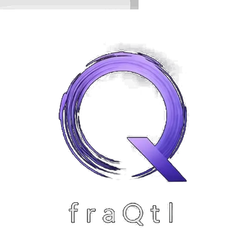

<p align="center">
  
</p>

<h1 align="center">fraQtl Diagnostic</h1>

<p align="center">
  Fingerprint any transformer's compression potential — fast.
</p>

Measures per-layer:
- **γ** (stretched-exponential decay shape of the Hessian spectrum)
- **knee** (spectrum cutoff index)
- **k95** (directions needed for 95% of eigenvalue energy)
- **depth-law** (how decay shape evolves across layers)
- **compression potential** + suggested bit budgets (Shannon-based)

Works on any HuggingFace-compatible transformer. ~3 min for a 0.5B model on
A100, ~5 min for 1B, ~10 min for 7B.

---

## Install

```bash
pip install fraqtl-diagnostic           # (once v0.1 lands on PyPI)
pip install -e /path/to/diagnostic-public  # editable install from source
```

## Use

```bash
fraqtl analyze meta-llama/Llama-3.2-1B-Instruct
```

```python
from fraqtl_diagnostic import analyze

report = analyze("meta-llama/Llama-3.2-1B-Instruct")
print(report.summary())
report.to_html("llama-1b_fingerprint.html")
report.to_png("llama-1b_fingerprint.png")
```

## Try it on your GPU in one command (Modal)

If you don't want to fight Python-env dependencies locally, the fastest way
to try the tool on a real model is via Modal (free tier gives you an A100):

```bash
# one-time: `pip install modal && modal setup`
# assumes a Modal secret named `huggingface` with an HF token

cd diagnostic-public/
modal run tests/modal_try.py --model-id Qwen/Qwen2.5-0.5B
modal run tests/modal_try.py --model-id TinyLlama/TinyLlama-1.1B-Chat-v1.0
modal run tests/modal_try.py --model-id mistralai/Mistral-7B-v0.1 --n-seqs 32 --seq-len 512

# pull the report back:
modal volume get fraqtl-hf-cache fraqtl-results/diagnostic-smoke ./reports/
```

---

## What you get

Three outputs, same data, different framings:

- **`*.json`** — machine-readable per-layer fingerprint (feed into other tools)
- **`*.html`** — human-readable report with tables + embedded figure
- **`*.png`** — 4-panel figure: spectrum overlay, γ depth-law, k95/layer, summary

---

## How to read the output

### γ (stretched-exponential shape parameter)

The Hessian input-covariance spectrum `λ_i` of each linear projection is fit
against `λ_i ≈ exp(−β · i^γ + c)`. γ is the *shape* of the decay:

| γ range   | interpretation                                          |
|-----------|---------------------------------------------------------|
| γ ≈ 0.3   | Stretched: fast head decay, long tail → compressible    |
| γ ≈ 0.5   | Typical for attention o_proj on Llama/Qwen/Mistral      |
| γ ≈ 0.8   | Typical for MLP down_proj on Llama/Qwen/Mistral         |
| γ ≈ 1.0   | Pure exponential decay — harder to compress aggressively |
| γ > 1.0   | Super-exponential (flat head, sharp crash) — limited    |

Lower γ = more compression headroom.

### k95 / dim

Fraction of eigendirections needed to capture 95% of eigenvalue energy. A
value of 0.1 means "95% of the Hessian mass lives in the top 10% of
directions" — prime territory for rank-preserving compression. Values
typical on production transformers:

| k95/dim range | implication                                   |
|---------------|-----------------------------------------------|
| < 10%         | very compressible, low-rank friendly          |
| 10–30%        | common; most dense transformers fall here     |
| 30–50%        | harder to compress without structured loss    |
| > 50%         | spectrum is near-uniform, limited headroom    |

### Depth-law

Linear fit of γ across layer depth. A negative slope is the common case
(shallow layers exponential, deep layers more stretched). The magnitude of
the slope × R² tells you whether the shape is a stable architecture property
or noisy per-layer.

### Suggested bit budget

Shannon-derived bits-per-weight that the information-theoretic ceiling can
tolerate at three conservatism tiers. **This is a ceiling, not a prediction.**
Real PPL loss from compression depends on the recipe (sign correction, rank
protection, per-model calibration). The diagnostic tells you how much room
the math leaves; the actual compression run tells you how close to the
ceiling you got.

---

## Status

**v0.1** (current): diagnostic metrics + suggested bit budgets.
**v1.0** (coming with Paper 3, ~4 weeks): adds Shannon-efficiency grading —
"your model is at X% of the theoretical ceiling vs competitors at Y%."

Same `pip install fraqtl-diagnostic` — grading is a layer on top of
diagnostic v0.1, not a separate tool.

---

## How it works (one-paragraph summary)

For each target projection `W : ℝ^d_in → ℝ^d_out`, we capture the input
covariance `H = E[x^T x]` on wikitext-2 calibration, then eigendecompose it.
The spectrum `λ_i` encodes how much of the layer's Jacobian mass lives along
each eigendirection of the input distribution. Tight universal shape (fixed
γ across layers) implies compressible redundancy; a fat-tailed spectrum
(high k95/dim) implies less. Shannon rate-distortion gives the
information-theoretic floor `D*(R) = geomean(λ) · 2^(−2R)` at any bit
budget R, which the diagnostic reports.

Full derivation + universality data across 8 architectures is in the
forthcoming Paper 3.

---

## Want to actually compress your model?

The diagnostic tells you the ceiling. The compression engine — sign
correction, per-model calibration, fused MoE experts — is the closed
part of the product:

  **[fraqtl.ai/compress](https://fraqtl.ai)**

---

## License

Apache 2.0.
